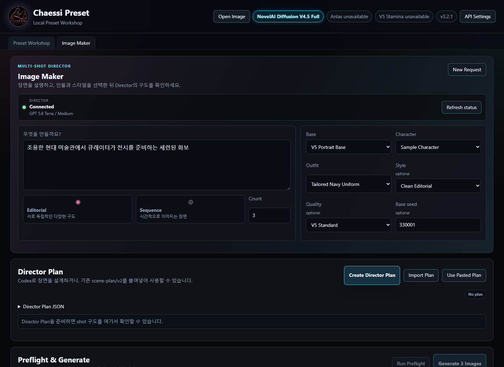
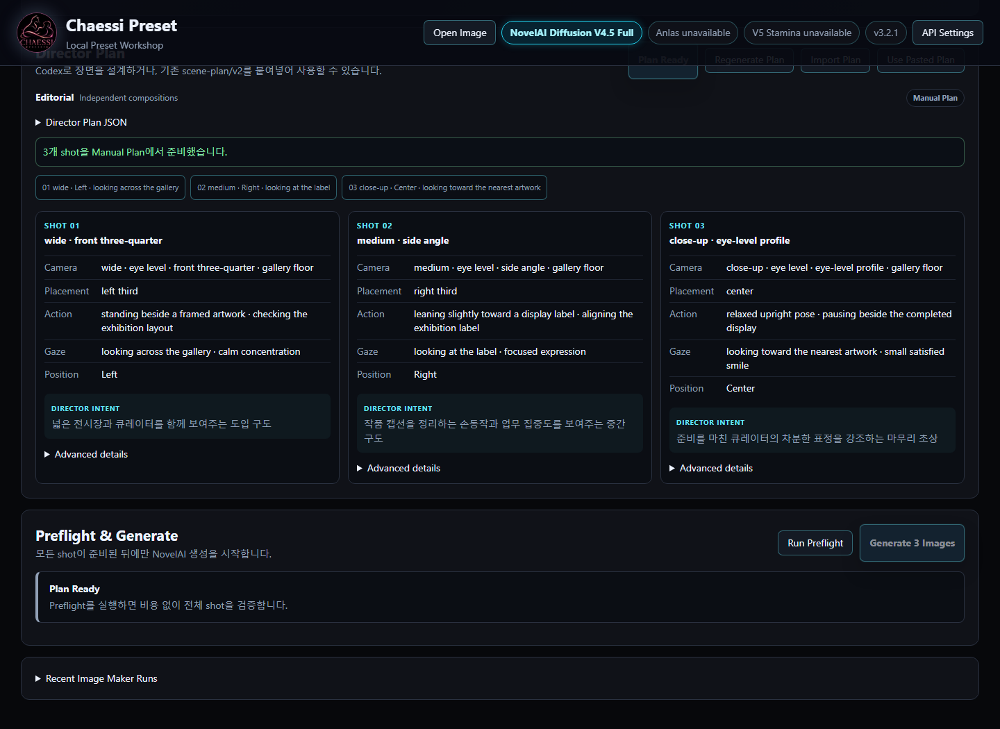
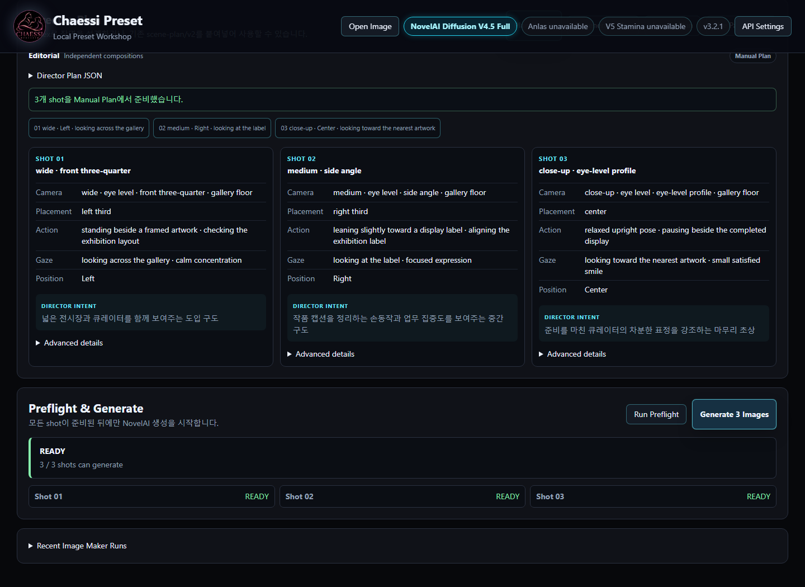
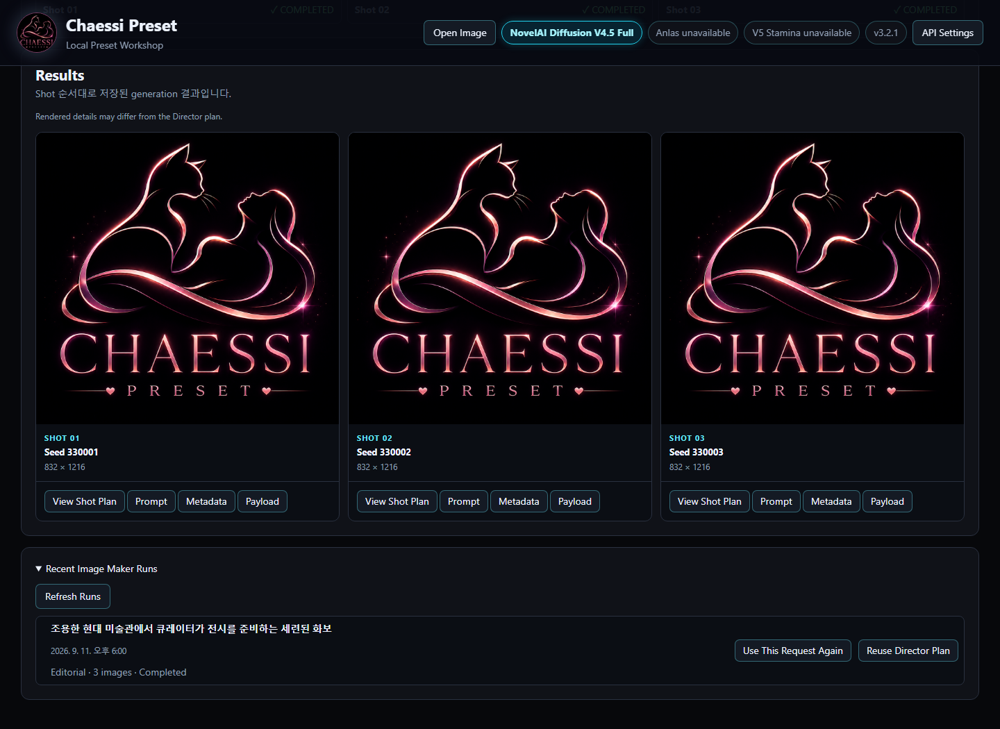

# Chaessi Preset

Chaessi Preset is a local preset and payload manager for NovelAI V4.5 Full and V5 Full text-to-image, image-to-image, and inpaint generation.

Chaessi Preset은 NovelAI V4.5 Full과 V5 Full의 text-to-image, image-to-image, inpaint 생성을 위한 로컬 프리셋 / 페이로드 매니저입니다.

Selectable generation models:

선택 가능한 생성 모델:

```text
nai-diffusion-4-5-full
nai-diffusion-5-full
```

| 기능 | NovelAI V4.5 Full | NovelAI V5 Full |
| --- | ---: | ---: |
| Text to Image | 지원 | 지원 |
| Image to Image | 지원 | 지원 |
| Inpaint | 지원 | 지원 |
| Character Prompt | 최대 6 | UI 최대 32 |
| AI’s Choice 위치 | 지원 | 지원 |
| Custom 자유 좌표 | 기존 방식 지원 | 지원 |
| Precise Reference | 지원 | NovelAI V5 미지원 |
| Vibe Transfer | 앱 미지원 | NovelAI V5 미지원 |
| Transparent Background | 앱에서 미지원 | 지원 |
| CFG Rescale | 지원 | 지원 |
| Tokenizer | T5 / 512 | Qwen / 1471 |
| Anlas 표시 | 공통 계정 상태 | 공통 계정 상태 |
| V5 Stamina | 해당 없음 | 표시 |

Inpaint mode automatically uses the matching inpainting model internally; it is not a user-selectable multi-model feature.

Inpaint 모드는 내부적으로 대응 inpainting 모델을 자동 사용하며, 사용자가 모델을 선택하는 multi-model 기능은 아닙니다.

```text
nai-diffusion-4-5-full-inpainting
nai-diffusion-5-full-inpainting
```

The app keeps this flow stable:

앱은 아래 흐름을 안정적으로 유지합니다.

```text
UI -> Internal Preset Schema -> Adapter -> NovelAI Payload -> NovelAI
```

Chaessi Preset v3.2.0 preserves the complete V4.5 Full workflow and supports V5 Full T2I, I2I, and Inpaint through the official multipart and MessagePack stream contract.

Chaessi Preset v3.2.0은 V4.5 Full 전체 흐름을 보존하면서 공식 multipart 및 MessagePack stream 계약에 맞춘 V5 Full T2I, I2I, Inpaint를 지원합니다.

V5 Precise Reference, Vibe Transfer, ControlNet, and SMEA/SMEA DYN are unavailable in NovelAI V5. V5 Curated, raw payload direct generation, scene composition, and video features are not included in Chaessi Preset v3.2.0.

Precise Reference, Vibe Transfer, ControlNet, SMEA/SMEA DYN은 현재 NovelAI V5에서 지원되지 않습니다. V5 Curated, raw payload 직접 생성, scene composition, video 기능은 Chaessi Preset v3.2.0에 포함하지 않았습니다.

## Public Version and Download / 공개 버전과 다운로드

- Current public version / 현재 공개 버전: **v3.3.0**
- Download / 다운로드: [GitHub Release v3.3.0](https://github.com/DooMokDdongGae/Chaessi-Preset/releases/tag/v3.3.0)
- Windows Portable app: `Chaessi-Preset-v3.3.0-x64.exe`
- SHA256: `00B907031D4F573A93256E84A2B67B9B4647E2C80539491FA8D36757C6A0F79B`

이 배포본은 Windows용 Portable Electron 앱입니다. 설치 프로그램이 아니므로 EXE를 다운로드해 직접 실행합니다. 기존 사용자 데이터는 EXE와 분리된 Electron userData에 저장되므로 새 EXE로 교체해도 프리셋과 History가 자동으로 삭제되지 않습니다.

## v3.3.1 development

현재 작업본은 **v3.3.1** Image Maker 사용성 보정입니다. 공개된 v3.3.0 tag와 asset은 변경하지 않습니다.

## Preset Workshop

기존 Preset Workshop은 그대로 유지됩니다. V4.5/V5 Text to Image, Image to Image, Inpaint, preset 관리, Position Pad와 History는 Image Maker와 별개의 top-level workspace에서 계속 사용할 수 있습니다.

```text
Chaessi Preset
├─ Preset Workshop
└─ Image Maker
```

## Image Maker

Image Maker는 자연어 요청에서 여러 장면의 구도 계획을 만들고, 생성 비용을 쓰기 전에 각 장면을 검사한 뒤 기존 Chaessi/NovelAI 생성 경로로 순차 실행합니다.

```text
User request
→ Codex Image Director
→ scene-plan/v2
→ Shot Cards
→ Preflight
→ Chaessi Composer
→ NovelAI
→ Gallery
```

역할은 명확히 나뉩니다.

- **Codex**: 카메라, 배치, 포즈, 행동, 시선과 장면 흐름을 계획합니다.
- **Chaessi**: 선택한 preset과 Director plan을 prompt 및 NovelAI payload로 구성합니다.
- **NovelAI**: 실제 이미지를 생성합니다.



### Image Maker requirements / 사용 조건

- 기존 이미지 생성과 동일한 NovelAI 계정 및 access token
- 자동 Director를 사용할 경우 [Codex CLI](https://learn.chatgpt.com/docs/codex/cli)
- Codex CLI에서 ChatGPT 로그인 완료

별도의 OpenAI API key는 Chaessi에 입력하지 않습니다. Codex CLI를 설치한 뒤 터미널에서 `codex login`으로 브라우저 로그인을 마치고, `codex login status`로 상태를 확인할 수 있습니다. 공식 OpenAI 문서도 Codex CLI의 첫 실행 또는 `codex login`에서 **Sign in with ChatGPT**를 선택하는 흐름을 안내합니다.

Image Maker의 runtime Director 기본값은 **GPT-5.6 Terra / Medium**입니다. 이는 장면 계획 전용 설정이며 개발 작업에 사용하는 Codex 모델 설정과 독립적입니다. Codex 사용 가능 여부는 앱에서 다음처럼 표시됩니다.

```text
Connected
Login required
Codex unavailable
Usage limit reached
```

Codex CLI가 없거나 로그인·사용량 문제로 자동 Director를 사용할 수 없어도 Preset Workshop은 정상 동작합니다. Image Maker에서는 **Paste Plan**, **Import Plan**, **Use Pasted Plan**으로 `scene-plan/v2`를 공급할 수 있습니다.

### Image Maker quick start / 빠른 시작

1. Chaessi Preset을 실행하고 NovelAI token을 저장합니다.
2. **Image Maker**를 엽니다.
3. 만들고 싶은 장면을 자연어로 입력합니다.
4. Editorial 또는 Sequence를 선택하고 이미지 수를 입력합니다.
5. 필요할 때만 **Add Preset**으로 Global 또는 Actor별 preset을 추가합니다.
6. **Generate**를 누릅니다. Director Plan과 Preflight는 자동으로 실행됩니다.
7. Gallery에서 이미지와 실제 최종 prompt를 확인하거나 복사합니다.

Image Maker의 모델, 해상도, Steps, Scale, Sampler, Seed, UC와 생성 모드는 현재 Preset Workshop 설정을 그대로 사용합니다. 같은 값을 Image Maker에서 다시 설정하지 않습니다. Manual Plan, Import Plan, raw JSON과 개별 Preflight는 Advanced recovery 도구에 남아 있습니다.



### Editorial and Sequence

- **Editorial**: 같은 컨셉을 유지하면서 서로 다른 구도의 이미지 여러 장을 계획합니다.
- **Sequence**: 앞 장면에서 다음 장면으로 행동과 소품 상태가 이어지는 이미지를 계획합니다.

사용자가 입력한 count만큼 shot을 만들며, 생성은 순차 실행됩니다. 중간 실패가 발생해도 이미 완료된 결과는 유지됩니다. 자동 retry는 하지 않습니다.

### Director Plan, Preflight, and cache

Director Plan은 생성 전에 사람이 읽을 수 있는 Shot Cards로 표시됩니다. **Preflight는 이미지 생성이 아니며 NovelAI 비용을 사용하기 전에 Director plan, preset, subject mapping, position과 payload를 검사하는 단계**입니다. NEEDS REVIEW 또는 FAILED가 있으면 Generate가 잠깁니다.



Codex Director 호출은 **Create Director Plan**과 **Regenerate Plan**에서만 발생합니다. Shot 보기, Preflight, Gallery, Recent Runs, Metadata와 Payload 확인은 Codex를 호출하지 않습니다. 동일 입력의 검증된 plan을 재사용하면 **Cached**로 표시되며 새 Director 호출이 발생하지 않습니다.

### Character and Outfit policy

Character subject와 Outfit category는 독립적입니다. `girl`/`boy`는 actor count와 Anchor subject를 나타내며, Outfit의 남성/여성 분류는 검색과 표시를 위한 metadata입니다. 따라서 male character + female outfit, female character + male outfit 모두 허용됩니다. Character selector에 Outfit preset을 넣는 것과 같은 실제 preset type mismatch는 계속 차단합니다.

### Results and renderer differences

Gallery는 shot 순서대로 generation ID, seed와 resolution을 보여주며 각 결과에서 Director Shot, prompt, metadata와 payload를 다시 확인할 수 있습니다.



NovelAI 결과는 Director Plan과 완전히 같지 않을 수 있습니다. 추가 인물·소품·스타일 고유 장식, outfit 또는 framing 편차는 renderer observation이며 그 자체로 pipeline 실패가 아닙니다. 필요하면 Undesired Prompt, negative weighting, style/seed 변경, 재생성 또는 Inpaint로 보정합니다.

### Authentication, privacy, and local data

Image Maker는 기존 Electron `safeStorage → NovelAI token provider → local server` 경로를 재사용하며 별도 NovelAI token을 저장하지 않습니다. Codex credential과 ChatGPT session credential도 앱 artifact, DOM, payload, metadata 또는 run manifest에 복사하지 않습니다. Local API는 `127.0.0.1`에만 열립니다.

Portable EXE와 사용자 데이터는 분리됩니다. preset, generation History, encrypted token과 Image Maker run/cache는 Electron `app.getPath("userData")` 아래에 남으므로 EXE를 교체해도 자동 삭제되지 않습니다.

## v3.2.1 Visual Character Position Pad

V5 Custom Position now offers a shared visual Position Pad: drag numbered markers in a manner similar to the official NovelAI app to place enabled Characters, up to 32 slots. The Pad follows the generation resolution's aspect ratio and uses normalized 0–1 coordinates with 0.001 precision, synchronized with the existing Advanced X/Y inputs.

V5 Character Custom Position에 공용 Position Pad를 추가했습니다. 공식 NovelAI 웹앱과 유사하게 번호 마커를 드래그해 활성 Character를 한 화면에서 배치할 수 있습니다(최대 32개 슬롯). Pad는 생성 해상도의 가로세로 비율을 반영하고, 0~1 좌표를 0.001 정밀도로 처리하며 기존 Advanced X/Y 숫자 입력과 양방향으로 동기화됩니다.

- 선택한 Character 강조와 중앙으로 되돌리기, 가까운 마커의 겹침 경고를 지원합니다. 경고는 생성을 막지 않습니다.
- Character 추가·삭제·재정렬과 프리셋 Load 시 위치 상태를 보존하며, AI’s Choice로 전환해도 Custom 좌표는 삭제하지 않습니다.
- 기존 preset/schema 및 History와 호환됩니다. V4.5에는 새 Pad를 표시하지 않고 기존 동작을 유지합니다.

## NovelAI V5는 V4.5와 무엇이 다른가

NovelAI V5 Full은 V4.5 Full과 별도의 모델입니다. Chaessi Preset은 모델별 profile, adapter, tokenizer와 지원 기능을 분리하며, 모델을 바꾸면 현재 모델에서 사용할 수 있는 UI만 표시합니다. NovelAI의 공개 안내는 [Image Generation: NovelAI Diffusion V5 is Here](https://journal.novelai.net/image-generation-novelai-diffusion-v5-is-here-c2df7c6b8d2d/)에서 확인할 수 있습니다.

### 모델과 prompting

- V4.5는 T5 tokenizer와 context당 512 tokens를 사용합니다.
- V5 Full은 Qwen 계열 tokenizer와 context당 1471 tokens를 사용합니다.
- Base Positive와 활성 Character Positive는 하나의 Positive context를 공유합니다.
- Base UC와 활성 Character UC는 별도의 Negative context를 공유합니다.
- Random Prompt는 편집 중 가능한 선택 결과를 기준으로 계산하고, Generate 직전 실제 선택된 문장으로 다시 해석·계산합니다. 저장된 preset에는 원래 `||a|b|c||` 문법이 유지됩니다.

### Character Prompt와 위치

- V4.5는 최대 6개 Character Prompt를 지원합니다.
- V5 공식 UI와 Chaessi의 V5 UI는 최대 32개 슬롯을 제공합니다. 이는 payload/UI 슬롯 한도이며 서로 다른 32명이 이미지에 반드시 표현된다는 뜻이 아닙니다.
- V5는 전체 캐릭터 배치를 모델에 맡기는 **AI’s Choice**와 각 Character에 자유 좌표를 지정하는 **Custom**을 지원합니다.
- Character Positive, UC, 좌표, 활성 상태와 순서는 model snapshot 및 preset round trip에서 보존됩니다.
- Character Prompt 개수와 Base Prompt의 `2girls`, `3girls` 같은 인원수 표현은 반드시 같을 필요가 없습니다. 지정되지 않은 인물은 Base Prompt의 영향을 받을 수 있으며 앱은 인원수 일치를 강제하지 않습니다.
- NovelAI가 공식 발표에서 예시로 언급한 최대 22명 표현과 UI의 32개 슬롯은 서로 다른 개념입니다.

### Quality와 Undesired Content

- V5 Quality는 **Standard**, **Light**, **None**을 지원하며 선택한 preset의 공식 quality 문구가 Positive prompt 뒤에 결합됩니다.
- V5 UC는 **Heavy**, **Light**, **Furry Focus**, **Human Focus**, **None**을 지원합니다.
- 사용자 UC는 선택한 UC preset 뒤에 결합되며 `{}`, `[]`, 수치 weighting 같은 문법을 변경하지 않습니다.
- Chaessi는 공식 UI 요청에서 확인한 preset 식별자와 tag hint를 adapter에서 구성합니다. 저장된 사용자 prompt 자체를 preset prefix로 덮어쓰지 않습니다.

### 생성 설정

새 V5 profile의 기본값은 `832×1216`, Steps `23`, Guidance `5`, CFG Rescale `0`, Euler Ancestral, Karras입니다. V4.5 새 profile은 같은 기본 해상도·Steps에서 Guidance `4`를 사용합니다. Euler Ancestral, Euler, DPM++ 2S Ancestral, DPM++ 2M SDE, DPM++ 2M, DPM++ SDE sampler를 모델 profile에서 선택할 수 있습니다.

V5 요청의 Noise Schedule은 공식 계약에 맞춰 Karras로 정규화되며 V5에서는 SMEA/SMEA DYN을 사용하지 않습니다. 이 값들은 **새 profile의 기본값**입니다. 기존 preset을 불러오면 저장된 모델별 값이 우선되므로, 기존 preset 값이 새 기본값으로 자동 교체된다고 해석하면 안 됩니다.

### 투명 배경

V5의 **Transparent Background**는 모델의 native alpha transparency를 요청합니다. 반환된 PNG alpha는 preview, thumbnail, History와 Save 흐름에서 보존되며 Chaessi가 결과를 불투명 배경에 로컬 합성하지 않습니다.

### Image to Image와 Inpaint

- V5 I2I는 `nai-diffusion-5-full`의 Image to Image mode이며 Strength와 Noise를 지원합니다.
- PNG, WebP, JPEG source를 파일 선택, Paste, Drag & Drop으로 입력할 수 있습니다.
- V5 Full 전용 Inpaint는 `Selection → Generation Padding → 8×8 binary generation mask → server request` 흐름을 사용합니다.
- source, 사용자가 그린 selection mask, 실제 전송 generation mask와 raw result는 History에서 서로 다른 자산으로 저장됩니다.
- NovelAI가 반환한 raw PNG를 로컬 composite 없이 최종 결과로 사용합니다.

### V5 Stamina와 Anlas

앱은 NovelAI 서버의 실제 계정 상태를 읽어 Anlas 잔액과 V5 Stamina 표시용 백분율만 renderer에 전달합니다. Stamina를 로컬 생성 횟수로 추정하지 않으며 token이나 전체 계정 응답을 renderer에 노출하지 않습니다. NovelAI가 Stamina 정책이나 회복 방식을 변경할 수 있으므로 고정된 일일 장수나 충전 속도를 영구 규칙으로 가정하지 마세요. Stamina가 부족한 경우에는 생성 전에 NovelAI가 표시하는 Anlas 비용 조건을 확인해야 합니다.

### V5에서 사용할 수 없는 기능

현재 NovelAI V5 자체에서 지원되지 않아 Chaessi의 V5 UI에서도 비활성화되는 기능은 **Precise Reference, Vibe Transfer, ControlNet, SMEA/SMEA DYN**입니다. 이 중 V4.5 Precise Reference는 Chaessi에서 계속 지원됩니다. 반면 V5 Curated, raw payload 직접 생성, scene composition과 video는 이 앱 v3.2.0의 제품 범위에 포함되지 않은 항목입니다.

<details>
<summary>기술적 호환성</summary>

V5 T2I/I2I/Inpaint는 공식 multipart request와 length-prefixed MessagePack stream 응답 계약을 사용합니다. V5 I2I는 기본 V5 Full 모델을, Inpaint는 대응 V5 Full inpainting 모델을 사용합니다. 이미지와 mask bytes는 JSON/Base64로 저장하지 않고 multipart binary part로 전송하며 raw result PNG bytes를 변환 없이 보존합니다.

</details>

## v3.2.0 History 관리와 탐색

- `삭제할 항목 선택` 모드에서 여러 History를 선택하고, 현재 표시된 항목을 한 번에 선택할 수 있습니다.
- 영구 삭제 전 확인창에서 삭제 개수와 관련 asset 삭제를 안내합니다.
- 이미지, sidecar, payload, I2I/Inpaint source와 mask, generation mask, reference asset을 안전한 경로 검증 후 함께 정리합니다.
- 부분 실패 시 성공·실패를 구분하고 실패 항목은 선택 상태로 유지해 다시 시도할 수 있습니다.
- History 확대 화면의 좌우 화살표와 키보드 `←`·`→`로 새 기록과 오래된 기록을 이동할 수 있습니다.
- 현재 위치와 함께 이미지, prompt, UC, model/settings, metadata가 같은 History ID 기준으로 갱신됩니다.
- 단계적 목록 렌더링을 유지하며 50개 경계를 넘을 때 Load More, 전체 sidecar scan, 전체 이미지 preload를 강제하지 않습니다.
- 기존 preset과 History는 호환되며 저장 schema는 변경되지 않았습니다.

## v3.1.1 성능 및 반응성 개선

v3.1.1은 저장 형식이나 생성 계약을 바꾸지 않고, History와 Character Preset이 많을 때의 화면 반응성을 개선한 패치 릴리즈입니다.

- History 상세 정보를 열 때 전체 History 목록을 다시 구성하지 않고 해당 항목을 직접 조회합니다.
- 큰 History 목록과 Character Preset 목록을 단계적으로 표시해 최초 화면 부담을 줄였습니다.
- History 선택 직후 loading 상태를 표시합니다.
- 여러 History를 빠르게 연속 선택했을 때 이전 요청이 최신 선택을 덮어쓰지 않습니다.
- Character Preset category 전환과 목록 동작의 중복 listener를 정리했습니다.
- 기존 preset, History, 모델 상태와 저장 schema는 그대로 호환됩니다.

This patch improves History and Character Preset responsiveness while preserving existing presets, History files, model state, and storage schemas.

## v3.1.0은 v2.4.0에서 무엇이 달라졌는가

### 다중 모델 구조와 V5 Full 지원

- V4.5 Full 전용 구조를 V4.5/V5 Full 선택 구조로 확장했습니다.
- Model Profile/Capability 기반 UI, 모델별 adapter와 tokenizer를 사용합니다.
- 모델 전환 시 지원 기능만 표시하며 V4.5는 시안, V5는 마젠타 네온 모델 배지로 구분합니다. 상단 version은 server health의 runtime version을 표시합니다.
- V5 T2I, I2I, Full Inpaint, Character Prompt UI 최대 32개, AI’s Choice/Custom positioning, Quality/UC preset, CFG Rescale, Transparent Background와 Qwen Token Counter를 지원합니다.

### 모델 상태와 preset 호환성

- 모델별 prompt와 params snapshot을 보존합니다.
- V5에서 V4.5로 전환해도 Character 7~32 데이터를 삭제하지 않으며 V5로 돌아오면 enable, prompt, UC, 좌표와 순서를 복원합니다.
- model 정보가 없는 기존 preset은 V4.5 preset으로 해석합니다.
- 기존 Character Prompt Preset은 모델과 독립적인 prompt module로 유지됩니다.
- 기존 category/subCategory와 등록되지 않은 legacy 문자열을 유지하며 전면 migration을 수행하지 않습니다.
- V5에서 Precise Reference UI가 숨겨져도 기존 V4.5 reference 데이터는 삭제되지 않습니다.

### Account Usage, 전송, History와 보안

- 실제 Anlas 잔액과 V5 Stamina 백분율을 표시하면서 기존 Electron safeStorage token 경로를 재사용합니다.
- renderer에는 token, Authorization 또는 전체 계정 응답을 전달하지 않습니다.
- V5 공식 multipart/MessagePack stream을 T2I, I2I, Inpaint에 적용합니다.
- source, mask, generation mask, raw result를 별도 자산으로 보관하고 저장 payload/sidecar에서 이미지 Base64를 제거합니다.
- History 삭제 시 해당 generation의 관련 자산도 함께 정리합니다.

### v2.4.0 기능 보존

Full Preset, Character Prompt Preset, 사용자 category/subCategory, Random Prompt Resolver, V4.5 T5 Token Counter, 통합 Image Intake, metadata import, thumbnail, History, V4.5 T2I/I2I/Inpaint, V4.5 Precise Reference와 safeStorage token 관리는 그대로 유지됩니다. 기존 preset을 계속 읽을 수 있지만 V4.5와 V5는 tokenizer와 token limit이 다르고, 모델에 따라 표시되는 UI가 달라집니다.

> **주의:** V5 Character Prompt 32 슬롯은 32명 출력 보장이 아닙니다. 또한 모델 전환으로 숨겨진 비호환 기능의 데이터는 삭제되지 않지만 현재 모델의 Generate 요청에는 포함되지 않습니다.

## Quick Start

Windows users do not need Node.js, npm, Git, or any development tools to use the portable EXE.

일반 Windows 사용자는 portable EXE를 사용하기 위해 Node.js, npm, Git 같은 개발 도구를 설치할 필요가 없습니다.

Download the EXE from GitHub Releases, run it, open **API Settings**, and save your NovelAI token.

GitHub Releases에서 EXE를 다운로드해 실행한 뒤, **API Settings**를 열고 NovelAI 토큰을 저장하면 됩니다.

What regular users need:

일반 사용자에게 필요한 것:

- Windows PC
- NovelAI account
- NovelAI access token
- Chaessi Preset portable EXE

- Windows PC
- NovelAI 계정
- NovelAI access token
- Chaessi Preset portable EXE

## Portable EXE

Current release build:

현재 릴리즈 빌드:

```text
dist/Chaessi-Preset-v3.3.0-x64.exe
```

The EXE is portable. You can move it to another folder and run it from there. User presets, character presets, token storage, and generation history are stored separately from the EXE, so replacing the EXE does not remove saved app data.

EXE는 portable 형식입니다. 다른 폴더로 옮겨서 실행할 수 있습니다. 사용자 프리셋, 캐릭터 프리셋, 토큰 저장소, 생성 기록은 EXE와 분리되어 저장되므로 EXE를 교체해도 저장된 앱 데이터는 삭제되지 않습니다.

The current release does not include an installer, code signing, or auto-update.

현재 릴리즈에는 installer, code signing, auto-update가 포함되어 있지 않습니다.

## Token Setup

Open **API Settings** in the app and save your NovelAI token.

앱에서 **API Settings**를 열고 NovelAI 토큰을 저장합니다.

Chaessi Preset stores the saved token with Electron `safeStorage` as encrypted local token data under the app userData directory. The token value is not shown again after saving and is not returned by API responses.

Chaessi Preset은 저장된 토큰을 Electron `safeStorage`를 사용해 앱 userData 디렉터리 아래에 암호화된 로컬 토큰 데이터로 저장합니다. 저장 후 토큰 값은 다시 표시되지 않으며 API 응답으로도 반환되지 않습니다.

Token status may show:

토큰 상태는 다음 중 하나로 표시될 수 있습니다.

```text
safe_storage
env
none
```

You can clear only the saved app token with **Clear Saved Token**. Environment variables are not deleted by the app.

**Clear Saved Token**은 앱에 저장된 토큰만 삭제합니다. 환경변수는 앱에서 삭제하지 않습니다.

Development mode can still use a local `.env` file or environment variable:

개발 모드에서는 로컬 `.env` 파일이나 환경변수를 계속 사용할 수 있습니다.

```env
NAI_ACCESS_TOKEN=YOUR_NOVELAI_ACCESS_TOKEN_HERE
```

Never commit `.env` or real tokens.

`.env`나 실제 토큰은 절대 커밋하지 마세요.

## Local Data

Development mode stores runtime data under the project-local `data/` directory.

개발 모드는 런타임 데이터를 프로젝트 로컬 `data/` 디렉터리에 저장합니다.

Electron and portable EXE mode store user data under Electron `app.getPath("userData")`.

Electron 및 portable EXE 모드는 사용자 데이터를 Electron `app.getPath("userData")` 아래에 저장합니다.

On Windows this is typically:

Windows에서는 일반적으로 다음 위치입니다.

```text
%APPDATA%\Chaessi Preset\
```

User data includes:

사용자 데이터에는 다음 항목이 포함됩니다.

```text
data/presets/
data/character-presets/
data/character-preset-categories/categories.json
data/base-prompts/
data/undesired-prompts/
data/params-presets/
data/generations/
secure-store/tokens.json
```

Existing project-local user data is copied into userData on first Electron use when the corresponding target folders do not already exist.

기존 프로젝트 로컬 사용자 데이터는 Electron을 처음 사용할 때, 대응하는 대상 폴더가 아직 없으면 userData로 복사됩니다.

## Features

- Integrated local workbench UI
- NovelAI V4.5 Full Text to Image / Image to Image / Inpaint generation
- NovelAI V5 Full Text to Image / Image to Image / Inpaint generation
- Internal preset schema and NovelAI payload adapter
- Exact local NovelAI V4.5 Full prompt token counters with shared context totals
- Unified PNG/WebP/JPEG image intake with file, clipboard, and drag-and-drop routing
- Conditional, explicit NovelAI metadata import
- Raw JSON metadata import
- Full preset Save / Save As / Load
- Character prompt presets with Save / Save As / Load / Delete
- Character prompt preset categories, one-level subcategories, and add-only Category Manager
- Base Prompt has a Preset button and can use the existing Character Prompt Preset library
- Character Prompt Presets can be loaded into Base Prompt or Character Slots from their own Preset buttons
- Character preset thumbnails
- Generation result preview and history
- Local result image save/delete
- Electron safeStorage token saving for the desktop app
- User presets and generations stored outside the app bundle through Electron userData

- 통합 로컬 작업대 UI
- NovelAI V4.5 Full Text to Image / Image to Image / Inpaint 생성
- NovelAI V5 Full Text to Image / Image to Image / Inpaint 생성
- internal preset schema와 NovelAI payload adapter
- 공유 context 합계를 포함하는 NovelAI V4.5 Full 공식 일치 로컬 프롬프트 토큰 카운터
- PNG/WebP/JPEG 파일, 클립보드, 드래그 앤 드롭을 지원하는 통합 이미지 입력 및 목적지 라우팅
- NovelAI metadata가 있을 때만 표시되는 명시적 선택 import
- Raw JSON metadata import
- 전체 프리셋 Save / Save As / Load
- 캐릭터 프롬프트 프리셋 Save / Save As / Load / Delete
- 캐릭터 프롬프트 프리셋 분류, 1단계 하위 분류, 추가 전용 Category Manager
- Base Prompt에 Preset 버튼이 있으며 기존 Character Prompt Preset 라이브러리를 사용할 수 있음
- 각 영역의 Preset 버튼에서 Character Prompt Preset을 Base Prompt 또는 Character Slot에 로드 가능
- 캐릭터 프리셋 썸네일
- 생성 결과 preview와 history
- 로컬 결과 이미지 저장/삭제
- 데스크톱 앱용 Electron safeStorage 토큰 저장
- 사용자 프리셋과 생성 기록을 Electron userData를 통해 앱 번들 밖에 저장

## Prompt Token Counters

Chaessi Preset counts NovelAI V4.5 Full prompt tokens locally and offline with a T5-compatible tokenizer validated against the official NovelAI UI. Base Prompt and enabled Character Prompts show their own token count plus the shared positive context total. Undesired Content and enabled Character Undesired fields use a separate shared negative context. The confirmed limit is 512 tokens per context; values at 80% are highlighted and values over the limit are shown in red without blocking Generate, matching the official warning behavior.

Chaessi Preset은 NovelAI 공식 UI와 대조 검증한 T5 호환 tokenizer로 NovelAI V4.5 Full 프롬프트 토큰을 로컬·오프라인에서 계산합니다. Base Prompt와 활성 Character Prompt는 각 입력란의 토큰 수와 공유 positive context 합계를 함께 표시합니다. Undesired Content와 활성 Character Undesired는 별도의 shared negative context를 사용합니다. 확인된 한도는 context당 512 tokens이며, 80% 이상은 경고색, 초과는 빨간색으로 표시하되 공식 UI의 경고 동작처럼 Generate를 차단하지 않습니다.

Random prompt blocks display the maximum token count among fully resolved alternatives. Up to 256 combinations are evaluated exactly; larger sets use a tokenizer-based maximum estimate without counting unresolved delimiters or summing every option. At Generate time, the existing Random Prompt Resolver creates a copy, the selected fields are counted exactly, and only the resolved copy is sent. Saved presets keep the original `||a|b|c||` syntax.

랜덤 프롬프트 블록은 완전히 확정된 선택지 조합 중 최대 토큰 수 하나만 표시합니다. 256개 이하 조합은 정확히 계산하고, 이를 초과하면 미확정 구분자를 세거나 모든 선택지를 합산하지 않고 tokenizer 기반 최대 예상값을 사용합니다. Generate 시점에는 기존 Random Prompt Resolver가 복사본을 만들고 실제 선택된 입력을 정확히 다시 계산한 뒤 resolved copy만 전송합니다. 저장된 preset에는 원본 `||a|b|c||` 문법이 유지됩니다.

## Unified Image Input

Use **Open Image**, paste a clipboard image, or drop image files anywhere outside a dedicated input zone. Chaessi validates PNG, WebP, and JPEG files, shows a preview, then lets you route one image to **Image to Image** or **Inpaint**, or add one or more images to **Precise Reference** in order. Dedicated source and reference zones continue to route images directly.

**Open Image**를 사용하거나 클립보드 이미지를 붙여넣거나 전용 입력 영역 밖에 이미지 파일을 드롭할 수 있습니다. Chaessi는 PNG, WebP, JPEG 파일을 검증하고 미리보기를 표시한 뒤, 이미지 한 장을 **Image to Image** 또는 **Inpaint**로 보내거나 여러 이미지를 순서대로 **Precise Reference**에 추가할 수 있게 합니다. 각 전용 source/reference 영역에서는 기존처럼 해당 목적지로 바로 입력됩니다.

NovelAI metadata import is shown only when supported metadata is detected in a single original image. Choosing an image destination never imports metadata automatically; Prompt, Undesired Content, Characters, and Settings / Seed are imported only through the separate explicit action.

NovelAI metadata import는 원본 이미지 한 장에서 지원 metadata가 감지될 때만 표시됩니다. 이미지 목적지를 고르는 것만으로 metadata가 자동 적용되지 않으며, Prompt, Undesired Content, Characters, Settings / Seed는 별도의 명시적 import 동작으로만 가져옵니다.

## Generation Modes

**Text to Image** keeps the existing v1.5.1 generation flow and remains the default mode.

**Text to Image**는 기존 v1.5.1 생성 흐름을 그대로 유지하며 기본 모드입니다.

**Image to Image** accepts PNG, WebP, or JPEG source images. Use **Strength** to control how strongly the result departs from the source and **Noise** to control added variation. The source image is transmitted at its original dimensions without stretching.

**Image to Image**는 PNG, WebP, JPEG source image를 지원합니다. **Strength**로 원본에서 얼마나 변화할지 조절하고, **Noise**로 추가 변화를 조절합니다. Source image는 비율을 왜곡하지 않고 원본 크기로 전송됩니다.

**Inpaint** uses the source image as a canvas. Paint the region to regenerate with **Brush**, remove mask pixels with **Eraser**, and use **Undo**, **Redo**, or **Clear Mask** as needed. Source and mask dimensions must match, and an empty mask cannot be generated.

**Generation Padding** expands the selection sent to NovelAI from 0 to 32 pixels, with a verified default of 16px. After padding, the full-resolution generation mask is aligned to uniform 8x8 binary blocks. White pixels regenerate and black pixels preserve.

**Generation Padding**은 NovelAI로 보내는 선택 영역을 0~32px 확장하며, 검증된 기본값은 16px입니다. Padding 적용 후 전체 해상도의 generation mask를 균일한 8x8 이진 블록으로 정렬합니다. 흰색 픽셀은 재생성하고 검정 픽셀은 보존합니다.

**Inpaint**는 source image를 작업 캔버스로 사용합니다. 다시 생성할 영역을 **Brush**로 칠하고, **Eraser**로 마스크를 지우며, 필요하면 **Undo**, **Redo**, **Clear Mask**를 사용합니다. Source와 mask 크기는 같아야 하며 빈 mask로는 생성할 수 없습니다.

NovelAI's raw Inpaint PNG is used directly as the final image and History result. No local feather/composite pass is applied. Source, selection mask, and transmitted generation mask remain separate generation-time assets; payload and sidecar JSON do not contain full image Base64 data.

NovelAI의 raw Inpaint PNG를 최종 이미지와 History 결과로 그대로 사용합니다. 로컬 Feather/Composite 처리는 적용하지 않습니다. Source, selection mask, 실제 전송 generation mask는 생성 시점의 별도 자산으로 보관되며 payload와 sidecar JSON에는 전체 이미지 Base64 데이터가 들어가지 않습니다.

Advanced Crop -> Generate -> Composite is not included in v3.2.0.

고급 Crop -> Generate -> Composite는 v3.2.0에 포함되지 않습니다.

## Precise Reference

Precise Reference is optional global generation conditioning available for V4.5 Full Text to Image, Image to Image, and Inpaint. It remains disabled for V5 Full.

Precise Reference는 V4.5 Full Text to Image, Image to Image, Inpaint에서 선택적으로 사용하는 전역 generation conditioning이며 V5 Full에서는 비활성화됩니다.

Each reference can be enabled or disabled and configured as **Character**, **Style**, or **Character & Style**. **Strength** controls how strongly the reference influences the result, while **Fidelity** controls how closely its details are followed. The slider range is 0 to 1 in 0.05 steps; the numeric input also supports finite values outside that range, including negative values, as in the official NovelAI UI.

각 reference는 활성화하거나 비활성화할 수 있으며 **Character**, **Style**, **Character & Style** 중 하나로 설정합니다. **Strength**는 결과에 미치는 영향의 크기를, **Fidelity**는 세부 특징을 얼마나 충실히 따를지를 조절합니다. 슬라이더 범위는 0부터 1까지 0.05 간격이며, 숫자 입력란에서는 공식 NovelAI UI와 같이 음수를 포함한 범위 밖의 유한 값도 사용할 수 있습니다.

Multiple Character references are blended together; they are not assigned to separate Character Slots. Precise Reference adds 5 Image Anlas per active reference for each generated image. Inpaint may need lower Style or Character & Style Strength/Fidelity values to avoid overpowering the surrounding image.

여러 Character reference는 서로 섞여 적용되며 각 Character Slot에 따로 배정되지 않습니다. Precise Reference는 생성 이미지 한 장마다 활성 reference 하나당 Image Anlas 5가 추가됩니다. Inpaint에서는 주변 이미지보다 reference 영향이 과해지지 않도록 Style 또는 Character & Style의 Strength/Fidelity를 낮춰야 할 수 있습니다.

Reference images are prepared locally as centered PNGs using the official V4.5 reference sizes. Only the prepared bytes are sent for generation. History stores those transmitted PNGs as separate assets, while payload and sidecar JSON keep only safe paths, byte lengths, hashes, and settings instead of image Base64.

Reference 이미지는 공식 V4.5 reference 크기에 맞춘 중앙 정렬 PNG로 로컬에서 준비되며, 준비된 bytes만 생성 요청에 사용됩니다. History에는 실제 전송 PNG를 별도 asset으로 저장하고, payload와 sidecar JSON에는 이미지 Base64 대신 안전한 경로, byte length, hash, 설정값만 기록합니다.

Vibe Transfer, reference preset libraries, and Character Slot-specific reference binding are not included in v3.2.0.

Vibe Transfer, reference preset library, Character Slot별 reference 연결은 v3.2.0에 포함되지 않습니다.

## Character Prompt Preset Categories

Character Prompt Presets support categories for organizing a large module-style preset library. Categories are only for organization and filtering. They are not connected to Character Slot numbers, and every Character Slot can freely load presets from every category.

Character Prompt Preset은 큰 모듈형 프리셋 라이브러리를 정리하기 위한 분류(Category)를 지원합니다. 분류는 정리와 필터링 용도일 뿐입니다. 분류는 Character Slot 번호와 연결되지 않으며, 모든 Character Slot은 모든 분류의 프리셋을 자유롭게 불러올 수 있습니다.

Saved Character Prompt Presets can also be loaded into Base Prompt through the Preset button in the Base Prompt area. Loading into Base Prompt uses replace behavior: the current Base Prompt and Undesired fields are replaced with the selected preset's prompt and undesired content. Append, merge, tag sorting, and duplicate removal are not performed.

저장된 Character Prompt Preset은 Base Prompt 영역의 Preset 버튼을 통해 Base Prompt에도 로드할 수 있습니다. Base Prompt로 로드할 때는 Replace 방식으로 동작합니다. 현재 Base Prompt와 Undesired 입력값이 선택한 프리셋의 prompt 및 undesired content로 교체됩니다. Append, merge, 태그 정렬, 중복 제거는 수행하지 않습니다.

The Character Prompt Preset dialog no longer uses a Load target dropdown. The target is decided by the button that opened the dialog: Base Prompt's Preset button loads into Base Prompt, and each Character Slot's Preset button loads into that slot.

Character Prompt Preset dialog는 더 이상 Load target 드롭다운을 사용하지 않습니다. 로드 대상은 dialog를 연 버튼으로 결정됩니다. Base Prompt의 Preset 버튼은 Base Prompt로 로드하고, 각 Character Slot의 Preset 버튼은 해당 슬롯으로 로드합니다.

Full Preset Save / Save As / Load is still the full workbench snapshot flow. Character Prompt Preset loading into Base Prompt does not replace or reduce Full Preset behavior.

전체 Preset Save / Save As / Load는 여전히 작업대 전체 스냅샷 흐름입니다. Character Prompt Preset을 Base Prompt에 로드하는 기능은 전체 Preset 기능을 대체하거나 축소하지 않습니다.

Default categories:

기본 분류:

- 여성 캐릭터
- 남성 캐릭터
- 여성 의상
- 남성 의상
- 구도·카메라
- 배경·소품
- 조명
- 그림체
- 품질
- 기타

Use **Manage Categories** to add a new top-level category or one level of subcategories under any built-in or custom category. New values appear immediately in the Save/Save As selectors and list filters. v2.1.0 is add-only: rename, delete, reorder, and deeper category trees are not included.

**Manage Categories**에서 새 상위 카테고리를 추가하거나 built-in 및 사용자 카테고리 아래에 1단계 하위 카테고리를 추가할 수 있습니다. 새 항목은 Save/Save As 선택지와 목록 필터에 즉시 반영됩니다. v2.1.0은 추가만 지원하며 이름 변경, 삭제, 순서 변경, 더 깊은 카테고리 트리는 포함하지 않습니다.

Custom category settings are stored at `data/character-preset-categories/categories.json` under Electron userData. Unregistered legacy category and subCategory strings remain visible, filterable, and unchanged when a preset is loaded or saved again.

사용자 카테고리 설정은 Electron userData 아래 `data/character-preset-categories/categories.json`에 저장됩니다. 등록되지 않은 legacy category 및 subCategory 문자열도 계속 표시되고 필터링되며, 프리셋을 다시 불러오거나 저장해도 임의로 바뀌지 않습니다.

Existing character prompt presets without category data are shown as `기타`.

분류 정보가 없는 기존 캐릭터 프롬프트 프리셋은 자동으로 `기타`로 표시됩니다.

The old `여성 아웃핏` category is displayed as `여성 의상`, and the old `남성 아웃핏` category is displayed as `남성 의상` for compatibility.

기존 `여성 아웃핏` 분류는 호환성을 위해 `여성 의상`으로 표시되고, 기존 `남성 아웃핏` 분류는 `남성 의상`으로 표시됩니다.

`여성 의상` supports optional subcategories:

`여성 의상`은 선택형 하위 카테고리를 지원합니다.

- Casual / 캐주얼
- Street / 스트리트
- Sporty / 스포티
- Office / 오피스
- Girly / 걸리
- Glam / 글램
- Boudoir / 부두아르
- Uniform / 유니폼

`남성 의상` supports the same optional clothing subcategory flow, using `Dandy / 댄디` in place of the female clothing `Girly / 걸리` category:

`남성 의상`도 동일한 선택형 의상 하위 카테고리 흐름을 지원하며, 여성 의상의 `Girly / 걸리` 대신 `Dandy / 댄디`를 사용합니다.

- Casual / 캐주얼
- Street / 스트리트
- Sporty / 스포티
- Office / 오피스
- Dandy / 댄디
- Glam / 글램
- Boudoir / 부두아르
- Uniform / 유니폼

## Security Rules

Tokens must not appear in:

토큰은 다음 위치에 나타나면 안 됩니다.

- console logs
- API responses
- preset files
- payload files
- sidecar files
- history records
- browser UI plain text

- 콘솔 로그
- API 응답
- 프리셋 파일
- payload 파일
- sidecar 파일
- history 기록
- 브라우저 UI 일반 텍스트

The desktop app uses Electron safeStorage encrypted local token storage. At runtime, the decrypted NovelAI token is injected into the local server child process environment so the existing TokenProvider / EnvSecretStore request path can remain stable.

데스크톱 앱은 Electron safeStorage 기반 암호화 로컬 토큰 저장소를 사용합니다. 런타임에는 복호화된 NovelAI 토큰을 로컬 서버 child process 환경에 주입하여 기존 TokenProvider / EnvSecretStore 요청 경로를 안정적으로 유지합니다.

This is safer than plaintext `.env` storage for normal desktop use, but it is not a separate cloud secret manager, not a DRM system, and not a complete OS Credential Manager/keytar integration.

이는 일반 데스크톱 사용에서 plaintext `.env` 저장보다 안전하지만, 별도 클라우드 secret manager도 아니고 DRM 시스템도 아니며 완전한 OS Credential Manager/keytar 통합도 아닙니다.

## Limitations

Chaessi Preset v3.2.0 does not include V5 Precise Reference, Vibe Transfer, ControlNet, SMEA/SMEA DYN, V5 Curated, raw payload direct generation, reference preset libraries, advanced crop/composite, scene composition, video features, installer, code signing, or auto-update.

Chaessi Preset v3.2.0에는 V5 Precise Reference, Vibe Transfer, ControlNet, SMEA/SMEA DYN, V5 Curated, raw payload 직접 생성, reference preset library, 고급 crop/composite, scene composition, video 기능, installer, code signing, auto-update가 포함되어 있지 않습니다.

## For Developers

The commands in this section are for developers only. Regular Windows users do not need them to use the portable EXE.

이 섹션의 명령은 개발자용입니다. 일반 Windows 사용자는 portable EXE를 사용하기 위해 이 명령들이 필요하지 않습니다.

Install dependencies:

의존성 설치:

```powershell
npm install
```

Run the local web server:

로컬 웹 서버 실행:

```powershell
npm run start
```

Then open:

그 다음 아래 주소를 엽니다.

```text
http://127.0.0.1:4174/
```

Run the Electron desktop shell:

Electron 데스크톱 셸 실행:

```powershell
npm run electron:dev
```

Build the portable Windows executable:

Portable Windows 실행 파일 빌드:

```powershell
npm run electron:dist
```

## Build Exclusions

Packaged output excludes:

패키징 결과물에서는 다음 항목을 제외합니다.

- `.env`
- secrets
- logs
- tmp folders
- project-local `data/`
- private docs and archive folders
- local test scripts and generated smoke-test artifacts

- `.env`
- secrets
- logs
- tmp 폴더
- 프로젝트 로컬 `data/`
- private docs 및 archive 폴더
- 로컬 테스트 스크립트와 생성된 smoke-test 산출물

## License

MIT License. See `LICENSE`. The packaged T5 tokenizer vocabulary is derived from Google T5 under Apache License 2.0; see `THIRD_PARTY_NOTICES.md`.

MIT License를 사용합니다. `LICENSE`를 확인하세요. 패키지에 포함된 T5 tokenizer vocabulary는 Apache License 2.0의 Google T5에서 파생되었으며 `THIRD_PARTY_NOTICES.md`를 확인할 수 있습니다.
